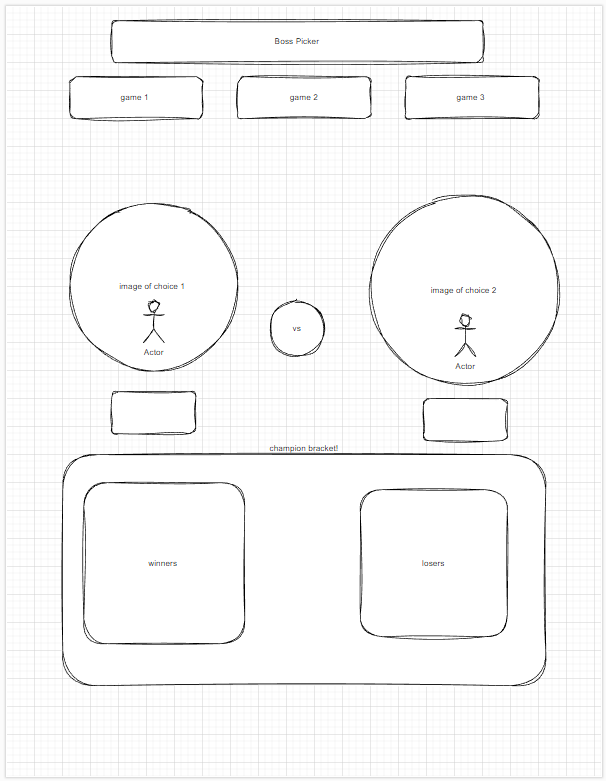
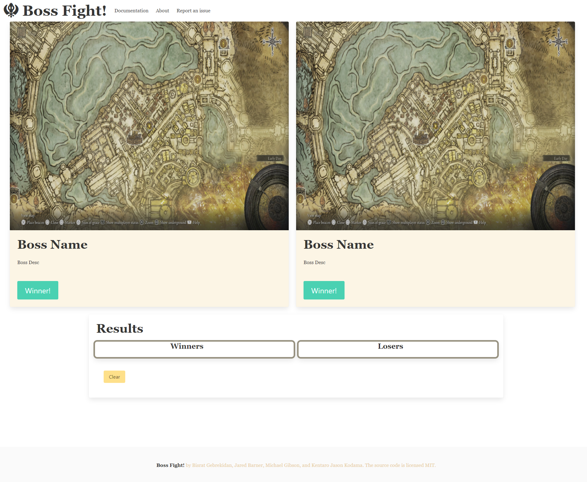

# Boss Fight!

### Original Markup

### Finished Product

---

### Table of Content

- [Boss Fight!](#boss-fight)
    - [Original Markup](#original-markup)
    - [Finished Product](#finished-product)
    - [Table of Content](#table-of-content)
  - [Description](#description)
  - [How To Use](#how-to-use)
      - [Deployment](#deployment)
      - [Installation](#installation)
  - [References](#references)
  - [License](#license)

---

## Description

Pit your favorite bosses against each other! This is a simple game that allows you to choose between two bosses and pit them against each other. You decide the winner with a simple click of a button. The game keeps track of the wins and losses for each boss and you can pit the winenrs against one another. The game is built using HTML, CSS, and JavaScript. The APIs and utilities used are listed below.
 
---

## How To Use

#### Deployment

The website is deployed via [pages](https://bizthehabesha.github.io/group-6-project-1/).

#### Installation

N/A

[Back To The Top](#boss-fight)

---

## References

 - [jQuery](https://jquery.com/)
 - [Bulma](https://bulma.io/)
 - [Font Awesome](https://fontawesome.com/)
 - [Elden Ring API](https://github.com/deliton/eldenring-api/)
 - [SuperHero Search API](https://rapidapi.com/jakash1997/api/superhero-search)

[Back To The Top](#boss-fight)

---

## License

MIT License Copyright (c) 2023 Bisrat Gebrekidan

[Back To The Top](#boss-fight)
